# Základy

## Typografie a sazba

- Sazba je proces převodu rukopisu (Word a exportovaný PDF) připraveného redaktorem do profesionálního tiskového souboru.

- Pro sazbu používáme Adobe InDesign. Preferujeme práci v nejnovější dostupné verzi InDesignu.

- Wordový rukopis by měl být jasně strukturovaný a obsahovat všechny prvky publikace: nadpisy, texty, úlohy a poznámky redaktora.

- Grafik by se měl soustředit především na vizuálně kvalitní zpracování rukopisu.

## Výkon a plánování práce

- Za standardní pracovní den (8 hodin) může grafik zpracovat přibližně 3 až 10 stran. Jde však pouze o **hrubý odhad**; počet stran za den záleží na:
  - složitosti layoutu
  - počtu a složitosti grafických prvků (obrázky, diagramy atd.)
  - vytíženosti grafika

- **Reálný odhad může poskytnout pouze grafik.**

- Při práci na více projektech současně se čas rozděluje mezi jednotlivé projekty.

- Do časového odhadu je nutné započítat i opravy a korektury. Tento odhad se bude výrazně lišit podle počtu komentářů a jejich složitosti.

## Google Drive vs Dropbox

- Google Drive používáme pro **pracovní dokumenty** a **sdílení**.

- Dropbox slouží pouze pro **ukládání finálních verzí**: zdrojových balíčků, tiskových PDF, náhledových PDF a případně i PDF pro doložku.

- Všechny soubory musí mít v názvu jasně uvedené datum (viz kapitola „Nahrávání na Dropbox“) a starší verze je nutné přesunout do složky `archiv`.

- U balíčků InDesignu není nutné při každé aktualizaci znovu nahrávat složku `Links`, protože na Dropboxu zbytečně zabírá místo. Pokud se v ní **určitě nic nezměnilo**, stačí nahrát pouze soubory `.indd` a `.idml`, jejich starší verze archivovat a složky `Links` a `Fonts` ponechat beze změny. Pokud si nejste jistí, raději nahrajte celý balíček.

## Kompatibilita fontů mezi Windows a macOS

- Při otevírání InDesign dokumentů mezi Windows a macOS může dojít k problémům s rozpoznáním fontů.

- Některé fonty mají ve Windows a macOS odlišné názvy.

- Řešením je nahradit fonty verzemi dostupnými v aktuálním systému.

- Po výměně fontů musíme vždy zkontrolovat vzhled dokumentu oproti exportovanému PDF.

## Důležité odkazy

- [Šablony obálek](https://drive.google.com/open?id=1sr4IgbKhAedO2TTbxRsmNPwxIty3rOS_&usp=drive_fs)

# Sazba

## Doporučení pro layout

- Design publikace by měl být dobře zarovnaný, konzistentní a přehledný.

- Použité grafické prvky (barvy, fonty, číslování, nadpisy, zarovnání textu apod.) musí být sjednocené napříč celou publikací.

- Při práci na nové knize v rámci existující řady je vhodné navazovat na předchozí díly.

- Barvy je vhodné přebírat z již vytištěných publikací, aby nedocházelo k příliš vybledlým nebo přesaturovaným odstínům.

- Vzorník barev by měl být omezený a znovupoužitelný.

## Zrcadlo sazby

- Je třeba nastavit tak, aby obsah nebyl příliš blízko okrajům stránky, dle pravidel zlatého řezu a s ohledem na druh vazby.

- U vazby V2 je třeba počítat se ztrátami ve hřbetu (cca 6–7 mm dle počtu stran a tloušťky papíru).

- Text by měl být minimálně 5 mm od všech okrajů.

## Spadávka

- Standardně používáme spadávku 5 mm, v krajním případě minimálně 3 mm.

## Zlom

- Na začátku vytvořte maketu publikace, rozvržení stran a kapitol.

- Definujte textové a znakové styly, vzorové strany se záhlavím a zápatím, automatickou paginaci a je dobré si připravit i vzorník barev

- Vše pojmenovávejte srozumitelně tak, aby se v dokumentu snadno orientoval i další grafik.

- Větší publikace doporučujeme rozdělit do InDesignové knihy.

- Snadno tak lze publikaci rozdělit na jednotlivé části a generovat pro potřeby redakce (korektury, opravy atd.) jednotlivá PDF, jednotlivě sbalit a podobně.

- Ve zlomu vždy zohledněte účel publikace (např. učebnice či pracovní sešit). Zejména u pracovních sešitů ponechte dostatek místa pro psaní.

- Doporučuji vytisknout a ideálně dát dítěti vyzkoušet. Případně se o to pokusit sám.
  Často je velmi nereálné se do prostoru vejít.

## Čárové kódy

- Generujte online, ideálně ve formátu SVG, EPS nebo AI.
  Např. zde: [https://freebarcodegenerator.com/](https://freebarcodegenerator.com/).

- Výsledný kód musí být **v křivkách** a **v režimu CMYK**, pouze černý (`C 0/M 0/Y 0/K 100`, nikoli složená černá).

- Pro publikace používáme čárový kód ISBN ve standardu EAN-13.

- tj.: `ISBN 978-606-95968-7-6` > `EAN-13 9786069596876`.
  Jde o stejné číslo, pouze bez pomlček.

## QR kódy

- QR kódy lze generovat online nebo přímo v InDesignu.

- Přednostně používejte vestavěnou funkci InDesignu (`Objekt > Vytvořit QR kód…`).

- QR kód musí být v křivkách a v režimu CMYK. U větších formátů lze použít barevné varianty.

- Minimální doporučená velikost je 12 mm.

- Výrazně to ulehčí jakoukoliv další editaci v průběhu samotné sazby a při pozdějších úpravách.

## Obrázky, ilustrace, vektory

- Podklady využíváme primárně ze Shutterstocku, Wikimedia nebo od vlastních ilustrátorů.

- Podle preferencí redaktorů mohou být obrázky generovány také pomocí AI (např. ChatGPT).

- U ostatních zdrojů vždy ověřujte autorská práva.

## Řešení

### Vrstva řešení

- Interaktivní pracovní sešity musí obsahovat samostatnou horní vrstvu s řešeními.

- Vrstva řešení musí jít jednoduše zapnout a vypnout.

- Řešení se obvykle netisknou, s výjimkou některých metodických příruček.

- Řešení by měla být vysázena ideálně v tmavě modré barvě. Preferovaný formát řešení zjistěte od redaktora.

- Každý úkol by měl mít vyplněné řešení. Pokud chybí, informujte redaktora.

<!-- image-group -->

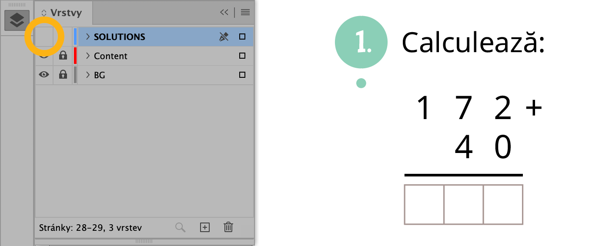

> Vrstva řešení vypnutá

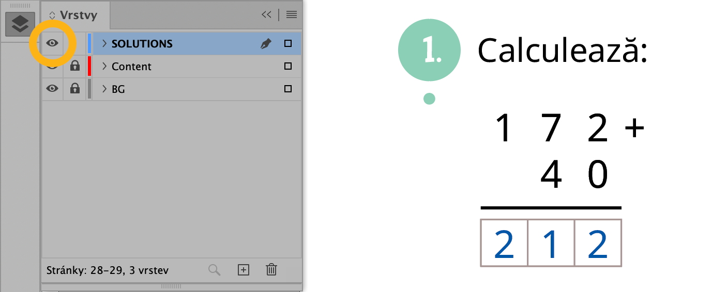

> Vrstva řešení zapnutá

<!-- /image-group -->

### Řešení k publikacím

- Všechna PDF s řešeními musí mít také **úvodní obálku**, aby nezačínala například obsahem a aby bylo ihned zřejmé, ke které publikaci řešení patří, jaké má ISBN a o které vydání jde. Obálky se vytvářejí pomocí nové samostatné vrstvy v již existujících zdrojových datech.

- Redaktor pouze požádá grafika o přípravu řešení. Grafik vytvoří řešení s obálkou a pošle je redaktorovi k další distribuci.

1. Ve zdrojových datech obálky vytvoříme novou vrstvu, pojmenujeme ji `reseni` a přesuneme ji navrch, pokud se tam nevytvořila automaticky.
2. Do této vrstvy nakopírujeme předpřipravený obsah vrstvy `reseni`, který odpovídá formátu obálky, ze souboru [RESENI_obalky-vzor.indd](https://drive.google.com/file/d/1A-n1tiPqh15n61elT3KLSqyTWNPbqvXD/view?usp=share_link). Případně lze vrstvu vytvořit podle pokynů v souboru PDF [RESENI_obalky-vzor.pdf](https://drive.google.com/file/d/1rXYhKG3y9-X1QKxCWvRBs8NyPXhXFutG/view?usp=share_link).
3. Upravíme ISBN, vydání a rok podle tiráže.
4. Vyexportujeme první stranu obálky bez spadávky a bez jakýchkoli značek.
5. Většina obálek je vytvořena tak, že přední a zadní vnější strana tvoří jednu stránku. Je proto nutné ji následně oříznout v Acrobatu pomocí funkce Nastavení rámečků stránky. Pro levý okraj zadáme polovinu aktuální šířky stránky a potvrdíme tlačítkem `OK`.

- Příklad: publikace má formát B5 > exportované PDF má rozměry 352 × 250 mm > levý okraj nastavíme na 176 mm > OK > po oříznutí by měla být viditelná pouze titulní strana obálky.

6. Ve složce s exportovaným vnitřkem s řešením vybereme obálku i vnitřek. Po kliknutí pravým tlačítkem zvolíme možnost `Spojit soubory v Acrobatu…`. Je nutné mít nainstalovaný Adobe Acrobat, nikoli pouze Acrobat Reader.
7. V náhledu přesuneme obálku na první pozici, pokud tam již není, a v pravém horním rohu klikneme na tlačítko `Zkombinovat`.
8. Nový soubor uložíme. Pro řešení je při ukládání vhodné zvolit možnost optimalizovaného PDF: soubor bývá výrazně menší a celé PDF se načítá rychleji.
9. Při úpravě obálky pro nové vydání s novým ISBN rovnou upravíme tyto údaje i ve vrstvě řešení.

- S touto změnou souvisí také pojmenování souborů na Dropboxu. V názvu PDF s řešením je nutné uvádět i číslo vydání, aby se s ním všem dobře pracovalo a aby nebylo nutné soubor otevírat kvůli zjištění vydání. Název by měl vypadat například takto: `HM1_PU-2dil_reseni-1vyd_(5-2-2026).pdf`. Ve složce s řešeními na Dropboxu ponechávejte všechna vydání. Do složky `archiv` je přesouvejte pouze v případě, že aktualizujete řešení bez změny vydání; od každého vydání by mělo být v základní složce právě jedno řešení.

# Export a ukládání dat

## Sbalení InDesign dokumentů

<!-- image-group -->

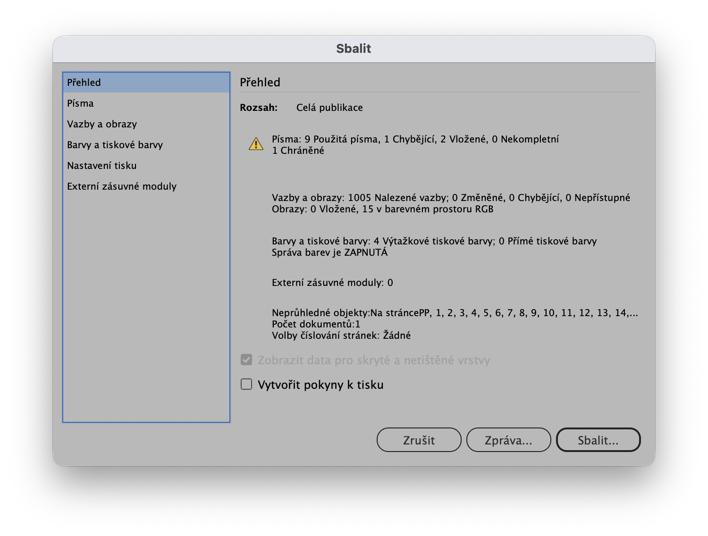

> Okno „Sbalit“

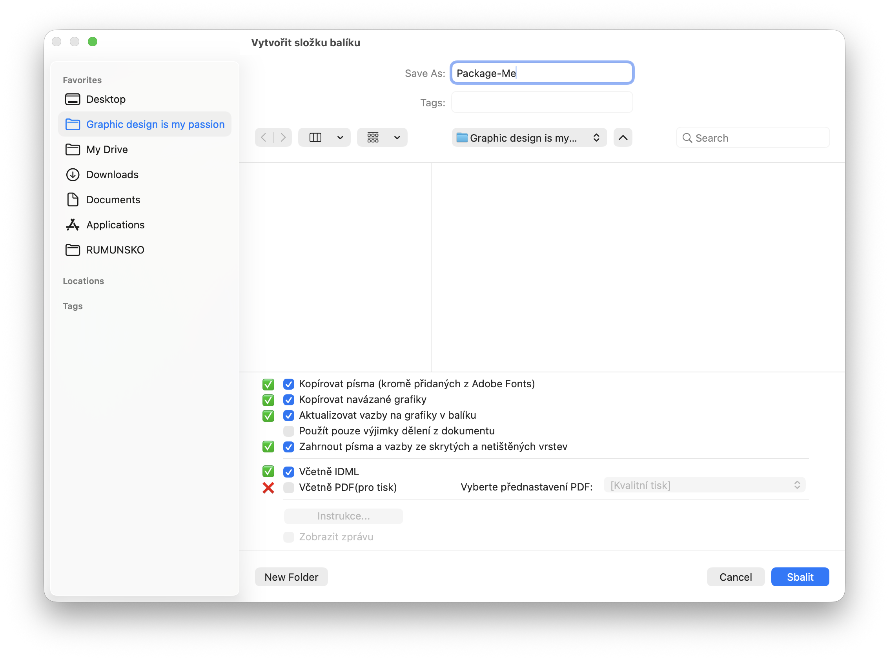

> Nastavení (tiskové PDF se zde negeneruje)

<!-- /image-group -->

- Sbalte kompletní dokument včetně **fontů**, **vazeb** (vč. vazeb ze skrytých vrstev) a **IDML souboru**.

- V názvech souborů **nepoužívejte diakritiku**, protože pak vznikají problémy při aktualizaci vazeb.

- Pokud jde o obrázek ze Shutterstocku, ponechte název souboru tak, jak je, např. `shutterstock_109250000.jpg`.

- Sbalení IDML umožňuje otevřít soubor i ve starší verzi InDesignu nebo na jiné platformě.

- Fonty je bohužel většinou nutné znovu aktivovat, protože používáme fonty z Adobe Creative Cloudu. InDesign je obvykle sám dohledá a stačí je stáhnout.

- Kontrolujte barevnost, rozlišení a kompletnost vazeb.

- Pokud se používají například duplexy (duotóny), je nutné je ve Photoshopu převést do CMYK, jinak se nevytisknou správně.

- Tiskové PDF přikládejte již hotové.

## Barevnost

- Ruční převod všech obrázků do CMYK není nutný, ale **doporučuje se**, protože při převodu barev může v tiskovém PDF dojít k barevným odchylkám.

- Při exportu do tiskového PDF je nutné zkontrolovat případné skryté vrstvy (např. řešení).

- Rozlišení obrázků by mělo být **ideálně 300 DPI**.

- Obrázky ve zlomu by neměly být zvětšeny nad 120 %.

- **Důležitá je výsledná vizuální kontrola exportovaného PDF.**

## Kontrola před výstupem

- Doporučuje se používat vlastní profil kontroly před výstupem v InDesignu (Preflight). Ten lze nastavit přes `Okna > Výstup > Kontrola` před výstupem. Může odhalit věci, které je jinak těžké podchytit, např. registrační černou ve vloženém obrázku.

- Kontrolovat zejména:

  - Chybějící a změněné vazby

  - Přímé barvy

  - Registrační černá

  - Rozlišení obrázků: 300+ DPI

  - Chybějící písmo

  - Přesahující text

  - Minimální velikost písma

  - Nastavení spadávky

## Nastavení PDF exportu pro tisk

<!-- image-group -->

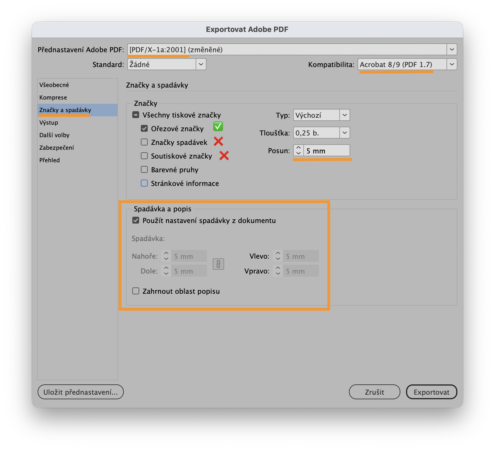

> Přednastavení PDF/X-1a, kompatibilita: Acrobat 8/9, nastavení tiskových značek

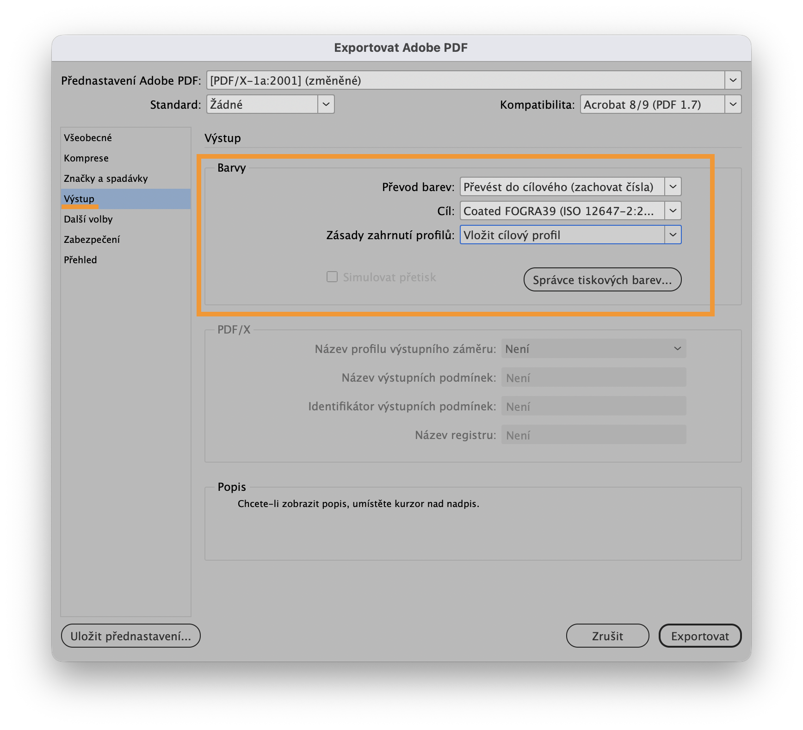

> Výstupní profil FOGRA39

<!-- /image-group -->

- Používejte přednastavení **PDF/X-1a**.

- Doporučená kompatibilita: **Acrobat 8/9**. V náhledu PDF se pak nezobrazují okraje objektů.

- Výstupní profil: **FOGRA39**; rozlišení: vysoké.

- Standardně exportujeme samostatné strany, nikoliv dvoustrany.

- Při exportu nastavte **spadávku** a **ořezové značky**. **Posun ořezových značek** má být stejný jako velikost spadávky, tedy například `spadávka 5 mm = posun značek 5 mm`. Značky pak nezasahují do oblasti spadávky a tiskárna má k dispozici čistou grafiku až ke značce řezu.

- Většina tiskáren **soutiskové značky** ani **značky spadávky** nepotřebuje. Doporučuje se ponechat pouze ořezové značky.

- Pro profesionálnější výsledek lze použít **export PDF přes PostScript a Distiller**:

1. Stáhněte přednastavení [Taktik_Tisk.prst](https://drive.google.com/file/d/1xUla2i2KjWNDN8vM9GdFz1q9UCqPv07l/view?usp=share_link).
2. V InDesignu načtěte přednastavení: `Soubor > Přednastavení tisku > Definovat...`; poté klikněte na `Načíst...` a vyberte stažené přednastavení.
3. Vyexportujte soubor PostScript: `Soubor > Tisk`; v nabídce `Přednastavení tisku` vyberte stažené přednastavení. Kliknutím na `Uložit` uložte soubor `.ps`.
4. Otevřete Acrobat Distiller. V horní části okna vyberte nastavení **PDF/X-1a:2001** a přetáhněte do okna soubor `.ps`. PDF se automaticky vyexportuje do stejné složky jako soubor `.ps`.

## Kontrola v Acrobatu

- Před nahráním na Dropbox proveďte vizuální kontrolu PDF v Adobe Acrobatu.

- Kontrolujte spadávky, ořezové značky, barevné pláty a ostrost obrázků.

- Pokud to TL/redaktor umožní, ideální je také kontrola naripovaných stránek z tiskárny (CTP).

## Přístupná PDF

Od grafika může být požadováno vytvoření přístupného PDF. Přístupné ("accessible") PDF umožňuje správné čtení dokumentu pomocí čteček obrazovky a dalších asistivních technologií.

### Nastavení struktury dokumentu v InDesignu

- Používejte styly odstavců a nadpisů pro správnou hierarchii obsahu.

- Každému důležitému obrázku přidejte alternativní text (Alt Text).

- Související objekty správně seskupujte.

### Panel Articles

- Otevřete `Window > Articles`.

- Přetáhněte textové rámečky, obrázky a další prvky do panelu ve správném pořadí.

### Tagování obsahu

- Zapněte `View > Structure > Show Structure`.

- Používejte správné tagy jako H1, P apod.

### Export do PDF

- Exportujte jako `Adobe PDF (Interactive)` nebo `Adobe PDF (Print)`.

- V záložce Tags zapněte `Create Tagged PDF`.

- V Accessibility povolte `Use Structure for Tab Order`.

### Kontrola v Adobe Acrobatu

- Spusťte `Tools > Accessibility > Full Check`.

- Zkontrolujte pořadí čtení, alternativní texty a hierarchii nadpisů.

## Nahrávání na Dropbox

- Data nahrávejte i při malých úpravách a **vždy aktualizujte** zdrojová i tisková data.

- Chybějící data nebo nesoulad v datech nahrání tiskových a zdrojových souborů plýtvají časem ostatních, kteří musí detektivně dohledávat, co se kdy upravovalo a zda jsou data aktuální!

- Dodržujte **jednotný systém názvů složek a souborů:**

<!-- dropbox-tree -->

- **ZAKLADNI SKOLY** – školní stupeň – Názvy složek bez diakritiky, s mezerami.
  - MATEMATIKA 1. stupen – předmět/stupeň
    - Hrava MATEMATIKA – řada
      - Hrava MATEMATIKA 1. rocnik – ročník
        - HM1 PRACOVNI UCEBNICE 1. dil – typ/díl publikace
          - **HM1 PRACOVNI UCEBNICE 1. dil – tisk**
            - HM1_PU-1dil_obalka_TISK_(20-6-2026).pdf – Názvy souborů bez mezer, s podtržítky.
            - HM1_PU-1dil_vnitrek_TISK_(20-6-2026).pdf
            - archiv
              - HM1_PU-1dil_vnitrek_TISK_(15-1-2025).pdf
          - **HM1 PRACOVNI UCEBNICE 1. dil – zdroje**
            - HM1 PU 1.dil obalka indd (20-6-2026)
              - Document fonts
              - Links
              - HM1_PU-1dil_obalka.indd
              - HM1_PU-1dil_obalka.idml
            - HM1 PU 1.dil vnitrek indd (20-6-2026)
              - (…)
              - archiv
              - HM1 PU 1.dil vnitrek indd (15-1-2025)

<!-- /dropbox-tree -->

- U každé publikace udržujte samostatné složky pro **tisková** a **zdrojová** data.

- Starší data **nikdy nemažte** – přesouvejte je do archivních složek.

- Datum musí být vždy součástí názvu exportovaných PDF.

## Odkazy z Dropboxu do Specifikací

1. Po najetí myší na název souboru klikněte na tlačítko `🔗` nebo `Share`.
2. V zobrazeném okně klikněte na odkaz `Manage`.
3. V části `Link for viewing` klikněte na `Create link`. Pokud odkaz již existuje, přejděte rovnou k dalšímu kroku.
4. V části `Password protection` klikněte na `Not applied > Set a password`.
5. Nastavte heslo `printer`. Ostatní nastavení ponechte takto:
   - Who can view: `Anyone with the link`
   - Link expiry: `Never`
   - Password protection: zapnuto (heslo: `printer`)
   - Downloads allowed: zapnuto
6. Nastavení potvrďte tlačítkem `Save settings`.
7. Až se zobrazí oznámení `✅ Settings updated`, klikněte na `🔗 Copy link`.
8. Odkaz poté vložte do příslušného pole ve Specifikaci publikace a odešlete jej ke kontrole.

- V Adminu: `Tisk > Specifikace > [zelené tlačítko Upravit před „ID“ u příslušného projektu]`
- Poté v sekci **Tisková data** vyberte obálku nebo vnitřek, vložte odkaz do pole „URL“ a klikněte na `Odeslat data ke kontrole`.

<!-- image-group -->

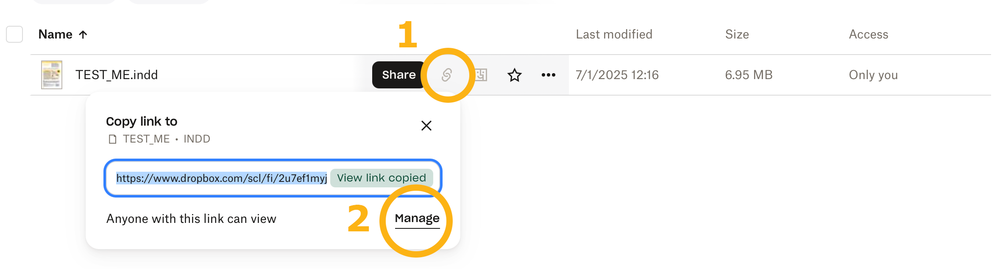

> Share > Manage

<!-- /image-group -->

<!-- image-group -->

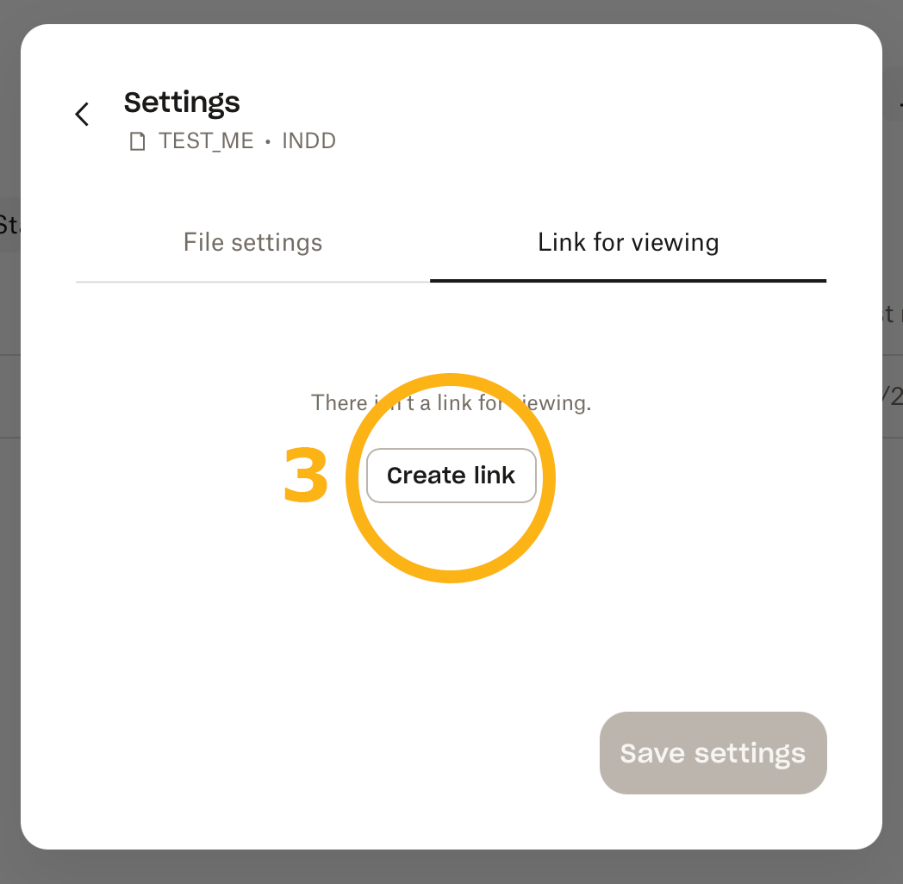

> Link for viewing > Create Link

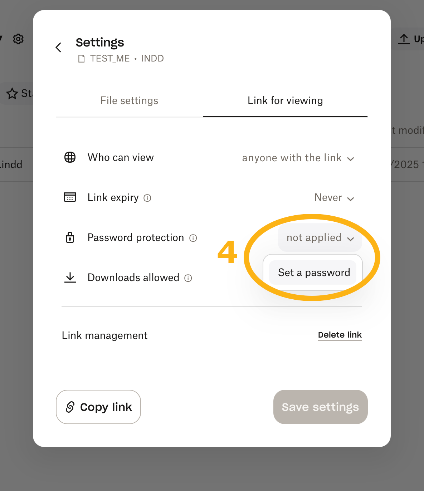

> Set a password

<!-- /image-group -->

<!-- image-group -->

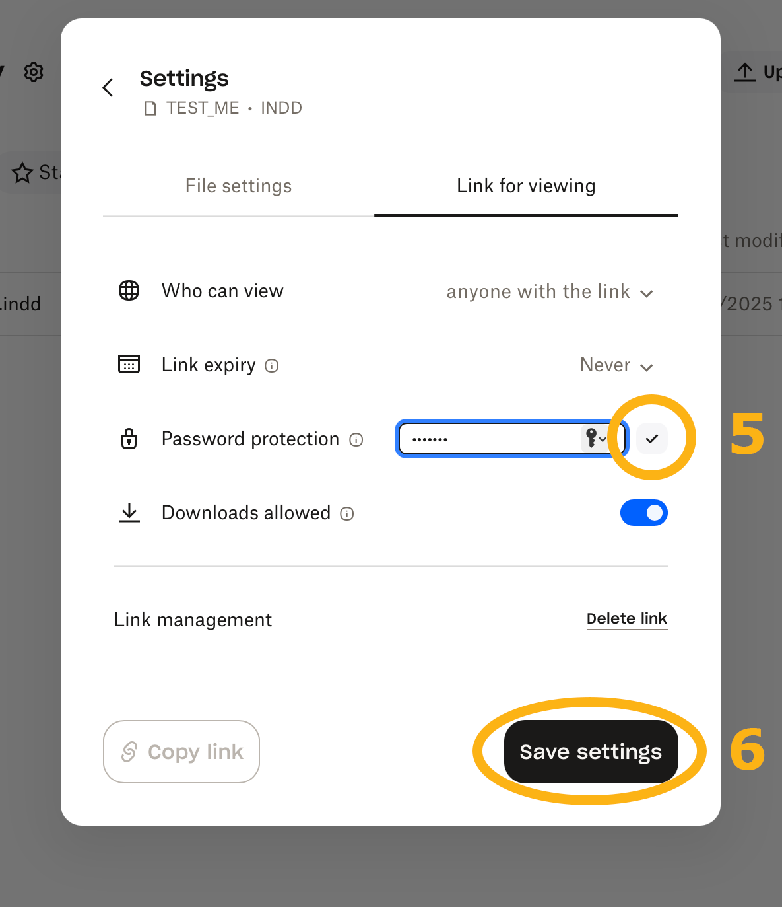

> Save settings

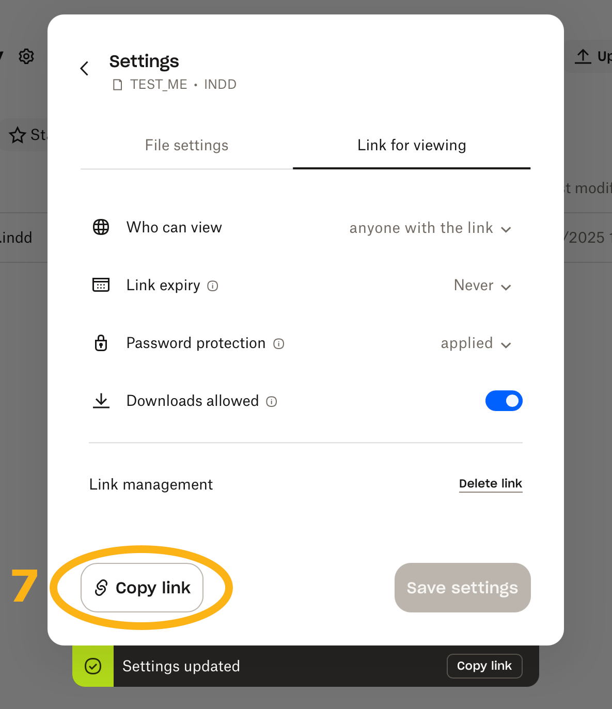

> Copy link

<!-- /image-group -->

# Redaktoři

## Role redaktora a grafika

- Grafik nebo sazeč určuje layout publikace: barvy, fonty, velikosti písma apod.

- Úkolem redaktora je připravit obsah publikace pro sazbu.

- Sazba je převod rukopisu z Wordu do profesionálního PDF pro tisk.

## Kontrola odborníkem

- Všechny materiály musí být schváleny odborným garantem před předáním grafikovi.

- Velké obsahové změny po vysázení výrazně komplikují práci.

## Struktura dokumentu

- Dokument musí mít jasnou strukturu: nadpisy, podnadpisy, texty, cvičení a další prvky.

- Doporučuje se nastavit dokument ve Wordu co nejblíže finálnímu layoutu PDF.

- Každá stránka musí být očíslovaná a musí být jasné, kam v publikaci patří.

## Obrázky

- Vkládejte výřezy obrázků nebo jasně označte jejich umístění.

- ANO: „Vložte tento obrázek do rámečku ve tvaru hvězdy: https://www.shutterstock.com/cs/image-vector/cow-238683511“

- NE: „Chtěla bych, abys vložila obrázek krávy. Mohla bys prosím umístit obrázek do rámečku ve tvaru hvězdy? Děkuji.“

- Vždy přidávejte odkazy na obrázky.

- Pokud pracujete s ilustrátorem, odkazy nejsou nutné, ilustrace dodá přímo.

## Komunikace s grafikem

- Komentáře musí být stručné, jasné a přehledné.

- Musí být zřejmé, ke které části stránky komentář patří.

- Grafik není odpovědný za obsahovou správnost textu.

## Korektury

- Po každém kole korektur vzniká nové PDF.

- Komentáře zapisujte vždy do nejnovější verze PDF.

- Doporučuje se systematické pojmenování PDF souborů.

## Vrstva řešení

- Řešení doporučujeme mít v InDesignu jako samostatnou zapínatelnou vrstvu.

- Budoucí změny pak není nutné dělat dvakrát.

- Pokud budou řešení dodána později, grafik o tom musí vědět předem.

## Schválení publikace

- Před tiskem musí publikaci zkontrolovat redaktor, team leader a případně majitel.

- Teprve poté grafik exportuje tiskové PDF a nahraje data na Dropbox.

## Nahrávání na Dropbox

- Po schválení publikace grafik nahraje data na Dropbox a vloží odkazy do Adminu.

- V této fázi by již neměly vznikat větší obsahové změny.
