# Introduction

## Typography and typesetting

- Typesetting is the process of converting a Word manuscript prepared by an editor into a professional print file.

- We use Adobe InDesign for typesetting. We prefer working in the latest available version of InDesign.

- The Word manuscript should be clearly structured and contain all publication elements: headings, texts, exercises, and editor’s notes.

- The designer should focus primarily on processing the supplied materials faithfully and to a high visual standard.

## Performance and work planning

- During a standard working day (8 hours), a designer usually completes 6 to 8 pages, depending on the complexity of the layout.

- One page therefore normally takes approximately 1 to 1.5 hours of work.

- When working on several projects at the same time, time is divided between the individual projects.

- Corrections and proofreading rounds must also be included in the time estimate.

## Google Drive vs Dropbox

- We use Google Drive for working documents and sharing.

- Dropbox is used only for storing final versions: source packages and print PDFs.

## Font compatibility between Windows and macOS

- When opening InDesign documents between Windows and macOS, problems with font recognition may occur.

- Some fonts have different names in Windows and macOS.

- The solution is to replace the fonts with versions available on the current system.

- After replacing fonts, we must always compare the appearance of the document with the exported PDF.

## Important links

- Cover template

- Cover template – Revised FEP

# Typesetting

## Layout recommendations

- The publication design should be well aligned, consistent, and clear.

- The graphic elements used (colours, fonts, numbering, headings, etc.) must be consistent throughout the publication.

- When working on a new book within an existing series, it is advisable to follow the preceding volumes.

- In most cases, use justified text unless instructed otherwise.

- It is advisable to take colours from publications that have already been printed, to avoid shades that are too faded or oversaturated.

- The colour swatch set should be limited and reusable.

## Type area

- It should be set so that the content is not too close to the page edges (a very common issue in the past), according to the rules of the golden ratio and with regard to the binding type.

- For perfect binding (V2), allow for loss in the spine (approximately 6–7 mm depending on the number of pages and paper thickness).

- Text in the header should be at least 5 mm from the trim edge.

## Bleed

- We normally use a 5 mm bleed; in exceptional cases, a minimum of 3 mm.

## Page make-up

- At the beginning, create a publication dummy and lay out the pages and chapters.

- Define paragraph and character styles, master pages with headers and footers, automatic pagination, and it is also useful to prepare a colour swatch set.

- Name everything clearly so that another designer can also navigate the document easily.

- We recommend dividing larger publications into an InDesign Book.

- This makes it easy to divide the publication into individual parts and generate separate PDFs for editorial needs (proofreading, corrections, etc.), package them individually, and so on.

- When making up pages, always take the purpose of the publication into account (e.g. a textbook or workbook). In workbooks in particular, leave enough space for writing.

- I recommend printing it and ideally letting a child try it. Alternatively, try it yourself.
  It is often very unrealistic to fit into the available space.

## Barcodes

- Generate them online, ideally in SVG, EPS, or AI format.
  For example here: https://freebarcodegenerator.com/.

- The resulting code must be converted to outlines and be in CMYK mode, black only (C 0/M 0/Y 0/K 100, not rich black).

- For publications, we use an ISBN barcode in the EAN-13 standard.

- i.e. ISBN: 978-606-95968-7-6 → EAN-13: 9786069596876.
  The same number, but without hyphens.

## QR codes

- QR codes can be generated online or directly in InDesign.

- Preferably use InDesign’s built-in function (Object → Generate QR Code…).

- They must also be converted to outlines and be in CMYK mode, black only (not rich black).

- For younger children, coloured variants can be used in larger formats.

- The minimum recommended size is 12 mm.

- This will make any further editing during typesetting and during later revisions considerably easier.

## Images, illustrations, vectors

- We primarily use materials from Shutterstock, Wikimedia, or our own illustrators.

- Depending on the editors’ preferences, images may also be AI-generated (e.g. ChatGPT).

- Always verify copyright for other sources.

## Answer layer

<!-- image-group -->

> Answer layer off

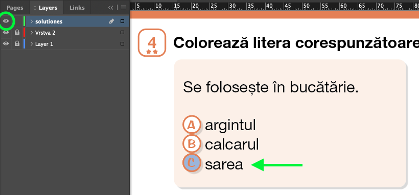

> Answer layer on

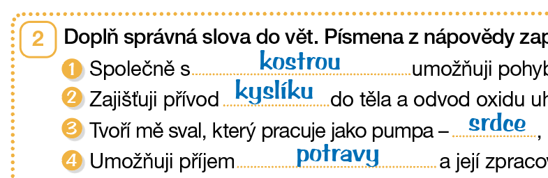

> Example answer

<!-- /image-group -->

- Interactive workbooks must contain a separate top layer with answers.

- The answer layer must be easy to turn on and off.

- Answers are usually not included in print, except in some teacher’s guides.

- Answers should be typeset in a handwriting font, ideally in dark blue. Ask the editor for the preferred answer format.

- Every exercise should have an answer filled in. If one is missing, inform the editor.

# Exporting and saving data

## Packaging InDesign documents

<!-- image-group -->

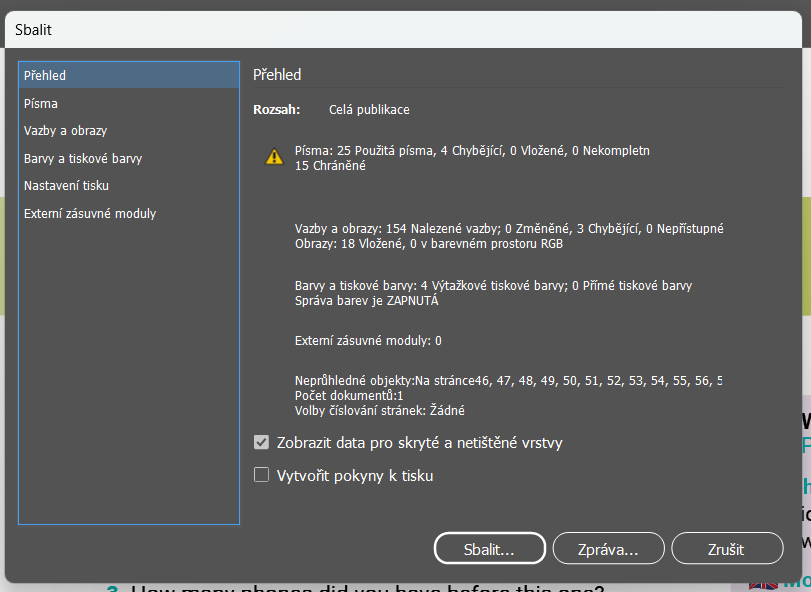

> ‘Package’ window

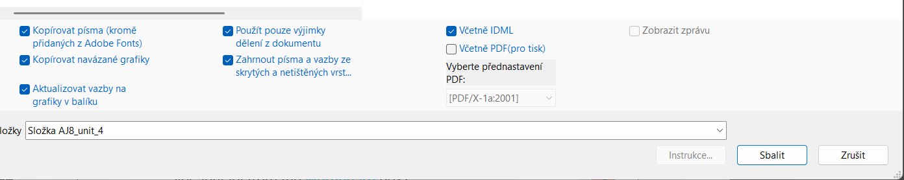

> Settings (the print PDF is not generated here)

<!-- /image-group -->

- Package the complete document, including fonts, links, and the IDML file.

- Including IDML in the package makes it possible to open the file in an older version of InDesign or on another platform.

- Unfortunately, fonts usually need to be reactivated because we use fonts from Adobe Creative Cloud. In most cases, however, InDesign finds them automatically and you only need to download them.

- Check the colour space, resolution, and completeness of the links.

- When duotones are used, for example, they must be converted to CMYK in Photoshop; otherwise they will not print correctly.

- Include the finished print PDF.

## Colour

- Mandatory manual conversion of all images to CMYK is not always necessary. During PDF/X-1a export, conversion takes place automatically according to the output profile (e.g. FOGRA39).

- When exporting the print PDF, check for any hidden layers (e.g. answers).

- Image resolution should not be lower than 240 dpi, ideally 300 dpi.

- Images in the layout should not be enlarged beyond 120%.

- A final visual inspection of the exported PDF is essential.

## Preflight

- It is advisable to use a custom Preflight profile in InDesign. It can be configured through Window → Output → Preflight. It can reveal issues that are otherwise difficult to catch, such as registration black in an imported image.

- Check in particular:

- Missing and modified links

- Spot colours

- Registration black

- Image resolution: 270 dpi

- Missing fonts

- Overset text

- Minimum font size

- Bleed settings

## Print PDF export settings

<!-- image-group -->

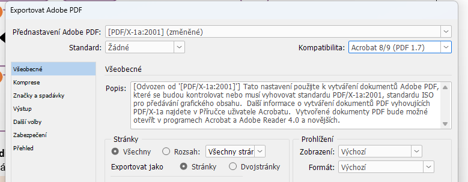

> PDF/X-1a preset, compatibility: Acrobat 8/9

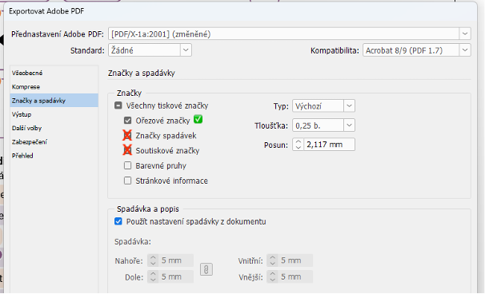

> Printer’s marks settings

<!-- /image-group -->

<!-- image-group -->

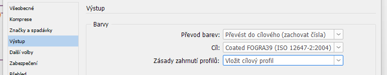

> FOGRA39 output profile

<!-- /image-group -->

- Set bleed and crop marks during export.

- Most printers do not need registration marks or bleed marks. We recommend retaining crop marks only.

- Use the PDF/X-1a preset.

- Recommended compatibility: Acrobat 8/9. This prevents object edges from appearing in the PDF preview.

- Output profile: FOGRA39, high resolution.

- We normally export individual pages, not spreads.

## Checking in Acrobat

- Before uploading to Dropbox, visually inspect the PDF in Adobe Acrobat.

- Check bleed, crop marks, colour separations, and image sharpness.

- Afterwards, it is also ideal to check the rasterised pages from the printer (CTP).

## Accessible PDFs

For a PDF to be read correctly by screen readers and other assistive technologies, it must be created as an accessible PDF.

### Setting up document structure in InDesign

- Use paragraph and heading styles to establish the correct content hierarchy.

- Add alternative text (Alt Text) to every important image.

- Group related objects correctly.

### Articles panel

- Open Window → Articles.

- Drag text frames, images, and other elements into the panel in the correct order.

### Tagging content

- Turn on View → Structure → Show Structure.

- Use the correct tags, such as H1, P, etc.

### Exporting to PDF

- Export as Adobe PDF (Interactive) or Adobe PDF (Print).

- In the Tags tab, enable Create Tagged PDF.

- Under Accessibility, enable Use Structure for Tab Order.

### Checking in Adobe Acrobat

- Run Tools → Accessibility → Full Check.

- Check the reading order, Alt Text, and heading hierarchy.

## Uploading to Dropbox

- Upload data even after small changes, and always update both source and print data.

- Missing data or discrepancies between the upload dates of print data and source files waste the time of others, who then have to investigate what was changed, when it was changed, and whether the data is current!

- Follow a consistent naming system for folders and files:

<!-- dropbox-tree -->

- **PRIMARY SCHOOLS – school level – Folder names without diacritics, with spaces.**
  - 📂 MATHEMATICS Stage 1 – subject/stage
    - 📂 Playful MATHEMATICS – series
      - 📂 Playful MATHEMATICS Year 1 – year
        - 📂 HM1 WORKBOOK 1st part – publication type/part
          - **📂 HM1 WORKBOOK 1st part – print**
            - 📄 HM1_PU-1dil_obalka_TISK_(20-6-2026).pdf
            - – File names without spaces, with underscores.
            - 📄 HM1_PU-1dil_vnitrek_TISK_(20-6-2026).pdf
            - 📂 archive
              - 📄 HM1_PU-1dil_vnitrek_TISK_(15-1-2025).pdf
          - **📂 HM1 WORKBOOK 1st part – sources**
            - 📂 HM1 PU 1st part cover indd (20-6-2026)
              - 📂 Document fonts
              - 📂 Links
              - 📄 HM1_PU-1dil_obalka.indd
              - 📄 HM1_PU-1dil_obalka.idml
            - 📂 HM1 PU 1st part interior indd (20-6-2026)
              - 📂 (…)
              - 📂 archive
              - 📂 HM1 PU 1st part interior indd (15-1-2025)

<!-- /dropbox-tree -->

- Maintain separate folders for print and source data for every publication.

- Never delete older data—move it into archive folders.

- The date must always be part of the exported PDF filename.

## Dropbox links in Specifications

<!-- image-group -->

> Hover over the filename and click the Share button.

<!-- /image-group -->

<!-- image-group -->

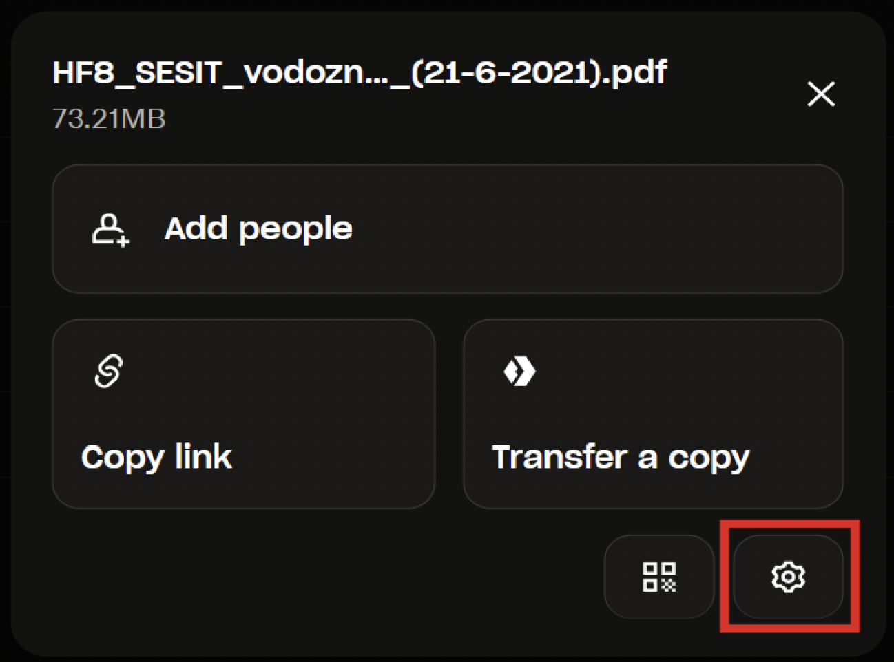

> In the pop-up window, open the sharing settings using the gear icon.

<!-- /image-group -->

<!-- image-group -->

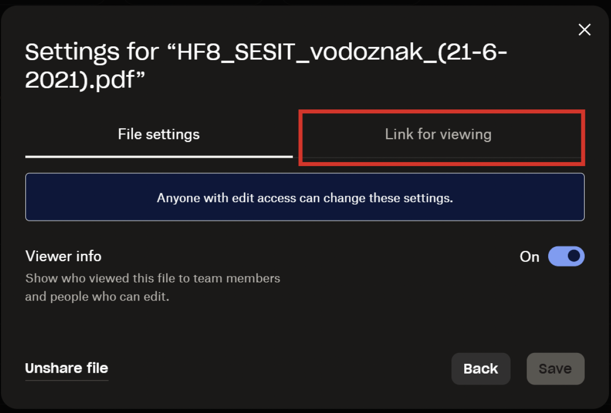

> In the Link for viewing tab, set the link parameters.

<!-- /image-group -->

<!-- image-group -->

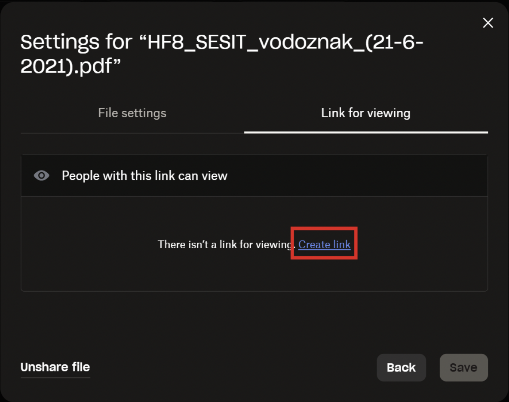

> If the link does not yet exist, click Create link.

<!-- /image-group -->

<!-- image-group -->

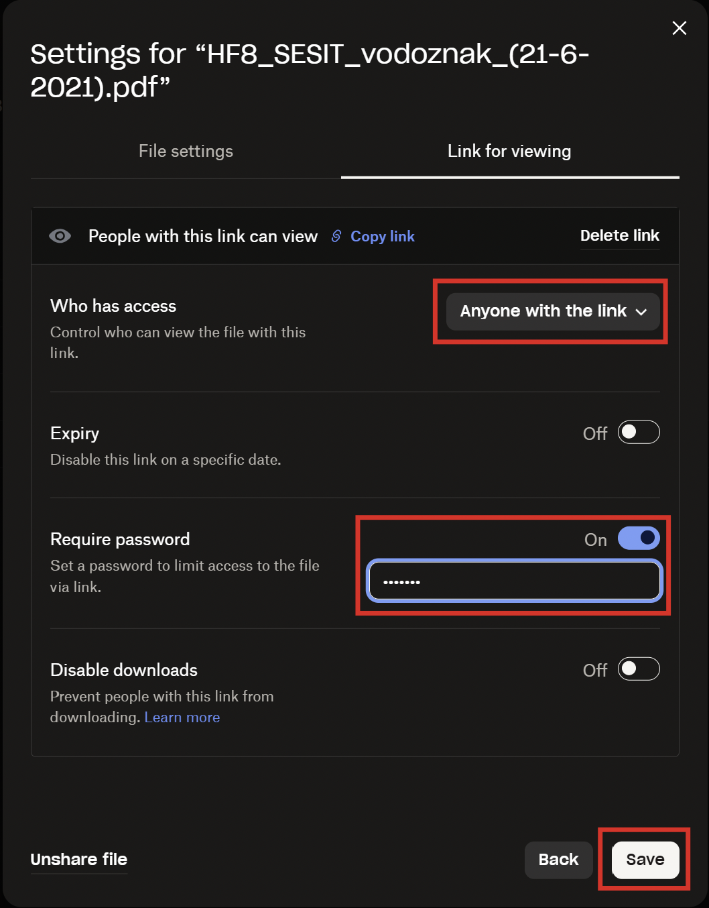

> The link must be set as follows:
> • Anyone with the link
> • Expiry: Off
> • Require password: On (password: printer)
> • Disable downloads: Off

<!-- /image-group -->

- Confirm the settings with the Save button.

<!-- image-group -->

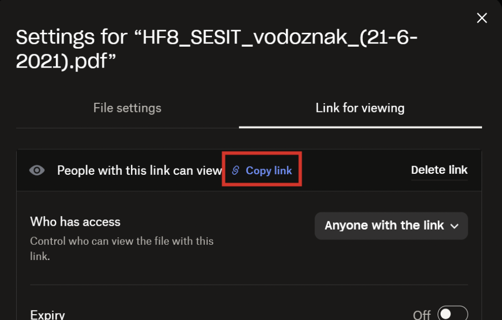

> Click Copy Link and copy the link.

<!-- /image-group -->

- Paste the link into the relevant field in the publication Specification and submit it for review.

- in Admin: Print → Specifications → [green edit button before the ‘ID’ of the relevant project]

- then: Print data section – cover or – interior; paste the link into the ‘URL’ field
  and press ‘Submit data for review’

# Editors

### The roles of the editor and designer

- The designer or typesetter determines the publication layout: colours, fonts, font sizes, etc.

- The editor’s task is to prepare the publication content for typesetting.

- Typesetting is the conversion of a Word manuscript into a professional PDF for printing.

### Subject-expert review

- All materials must be approved by a subject-matter guarantor before they are handed over to the designer.

- Major content changes after typesetting significantly complicate the work.

### Document structure

- The document must have a clear structure: headings, subheadings, texts, exercises, and other elements.

- It is advisable to set up the Word document as close as possible to the final PDF layout.

- Every page must be numbered, and it must be clear where it belongs in the publication.

### Images

- Insert image crops or clearly mark their placement.

- YES: ‘Insert this image into a star-shaped frame: https://www.shutterstock.com/cs/image-vector/cow-238683511’

- NO: ‘I would like you to insert a picture of a cow. Could you please place the picture in a star-shaped frame? Thank you.’

- Always include links to images.

- If you are working with an illustrator, links are not necessary; the illustrator will supply the illustrations directly.

### Communication with the designer

- Comments must be concise, clear, and easy to understand.

- It must be clear which part of the page each comment relates to.

- The designer is not responsible for the factual correctness of the text.

### Corrections

- A new PDF is created after every round of corrections.

- Always enter comments in the latest version of the PDF.

- Systematic naming of PDF files is recommended.

### Answer layer

- We recommend keeping answers in InDesign as a separate layer that can be switched on and off.

- Future changes then do not need to be made twice.

- If the answers will be supplied later, the designer must know this in advance.

### Publication approval

- Before printing, the publication must be checked by the editor, the team leader, and, where applicable, the owner.

- Only then does the designer export the print PDF and upload the data to Dropbox.

### Uploading to Dropbox

- After the publication is approved, the designer uploads the data to Dropbox and inserts the links into Admin.

- At this stage, there should no longer be any major content changes.
